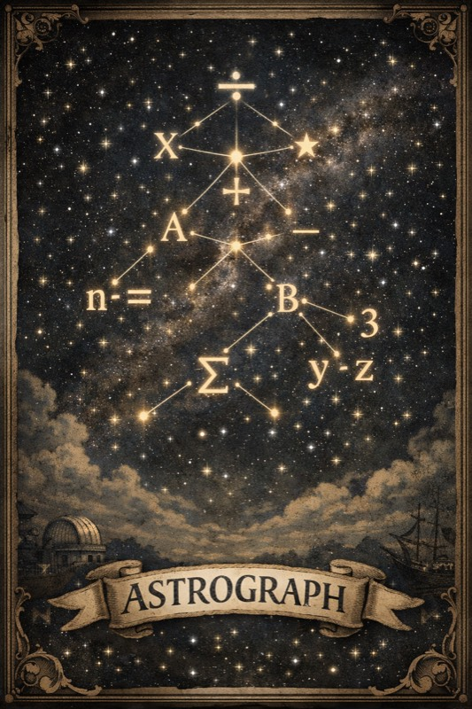

# ASTrograph

<p align="center">
  
</p>

[](https://hub.docker.com/r/thaylo/astrograph)
[](https://hub.docker.com/r/thaylo/astrograph)
[](LICENSE)
[](https://modelcontextprotocol.io)

An [MCP server](https://modelcontextprotocol.io) that stops AI agents from writing duplicate code. It offers improved write and edit tools that compare new code against every function already in your codebase using AST graph isomorphism, blocking the operation when a structural duplicate is found. Variable names, formatting, and comments are irrelevant -- if two pieces of code have the same abstract structure, ASTrograph treats them as duplicates.

## Installation

Add `.mcp.json` to your project root:

```json
{
  "mcpServers": {
    "astrograph": {
      "command": "docker",
      "args": [
        "run", "--rm", "-i", "--pull", "always",
        "--add-host", "host.docker.internal:host-gateway",
        "-v", ".:/workspace",
        "-v", "./.metadata_astrograph:/workspace/.metadata_astrograph",
        "thaylo/astrograph:latest"
      ]
    }
  }
}
```

That's it. The codebase is indexed at startup and re-indexed on file changes.

<details>
<summary><strong>Claude Desktop</strong></summary>

macOS: `~/Library/Application Support/Claude/claude_desktop_config.json`
Windows: `%APPDATA%\Claude\claude_desktop_config.json`

```json
{
  "mcpServers": {
    "astrograph": {
      "command": "docker",
      "args": [
        "run", "--rm", "-i", "--pull", "always",
        "--add-host", "host.docker.internal:host-gateway",
        "-v", "/absolute/path/to/project:/workspace",
        "-v", "/absolute/path/to/project/.metadata_astrograph:/workspace/.metadata_astrograph",
        "thaylo/astrograph:latest"
      ]
    }
  }
}
```

</details>

<details>
<summary><strong>Codex</strong></summary>

`~/.codex/config.toml`:

```toml
[mcp_servers.astrograph]
command = "docker"
args = [
  "run", "--rm", "-i", "--pull", "always",
  "--add-host", "host.docker.internal:host-gateway",
  "-v", "/absolute/path/to/project:/workspace",
  "-v", "/absolute/path/to/project/.metadata_astrograph:/workspace/.metadata_astrograph",
  "thaylo/astrograph:latest"
]
```

</details>

<details>
<summary><strong>Without Docker</strong></summary>

```bash
pip install .
```

```json
{
  "mcpServers": {
    "astrograph": {
      "command": "python",
      "args": ["-m", "astrograph.server"],
      "cwd": "/path/to/astrograph"
    }
  }
}
```

</details>

## How it works

Your codebase already contains:

```python
# src/math.py
def calculate_sum(a, b):
    return a + b
```

An AI agent tries to write:

```python
# src/utils.py
def add_numbers(x, y):
    return x + y
```

ASTrograph blocks the write:

```
BLOCKED: Cannot write - identical code exists at src/math.py:calculate_sum (lines 1-2).
Reuse the existing implementation instead.
```

Different variable names, identical structure. Source code is converted into labeled directed graphs and compared using Weisfeiler-Leman hashing with VF2 isomorphism verification. Text similarity is not involved.

## Language support

All languages require an explicit LSP binding via `astrograph_lsp_setup(mode='bind')`. No language server is bundled -- ASTrograph attaches to already-running servers over TCP or stdio. Unconfigured languages fail fast with no silent fallbacks.

| Language | Versions | Default endpoint |
|----------|----------|-----------------|
| Python | 3.11 -- 3.14 | `tcp://127.0.0.1:2090` |
| JavaScript | ES2021+, Node 20/22/24 LTS | `tcp://127.0.0.1:2092` |
| TypeScript | TypeScript 5.x, Node 20/22/24 LTS | `tcp://127.0.0.1:2093` |
| Go | 1.21 -- 1.25 | `tcp://127.0.0.1:2091` |
| C | C11, C17, C23 | `tcp://127.0.0.1:2087` |
| C++ | C++17, C++20, C++23 | `tcp://127.0.0.1:2088` |
| Java | 11, 17, 21, 25 | `tcp://127.0.0.1:2089` |

## Star History

[](https://www.star-history.com/#Thaylo/astrograph&type=date&legend=top-left)

## License

MIT
