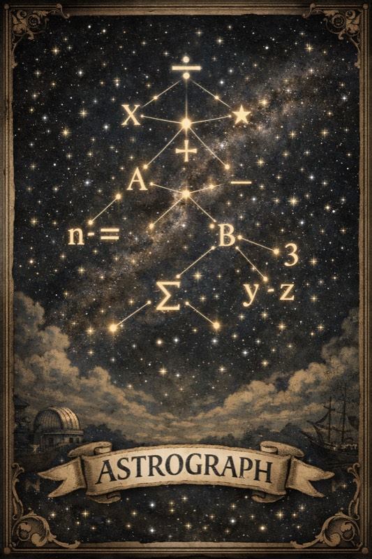

# ASTrograph

<p align="center">
  
</p>

[](https://github.com/Thaylo/astrograph/actions/workflows/ci.yml)
[](https://github.com/Thaylo/astrograph/actions/workflows/release.yml)
[](https://hub.docker.com/r/thaylo/astrograph)
[](https://hub.docker.com/r/thaylo/astrograph)
[](LICENSE)
[](https://modelcontextprotocol.io)

An [MCP server](https://modelcontextprotocol.io) that stops AI agents from writing duplicate code. It offers improved write and edit tools that compare new code against every function already in your codebase using AST graph isomorphism, blocking the operation when a structural duplicate is found. Variable names, formatting, and comments are irrelevant — if two pieces of code have the same abstract structure, ASTrograph treats them as duplicates.

## Installation

Add `.mcp.json` to your project root:

```json
{
  "mcpServers": {
    "astrograph": {
      "command": "docker",
      "args": [
        "run", "--rm", "-i", "--pull", "missing",
        "--add-host", "host.docker.internal:host-gateway",
        "-v", ".:/workspace",
        "thaylo/astrograph:latest"
      ]
    }
  }
}
```

The image is multi-arch (amd64, arm64). The codebase is indexed at startup and re-indexed on file changes. Metadata is stored outside the project directory (in the user data dir) so it never interferes with your codebase.

To update to a new release:

```bash
docker pull thaylo/astrograph:latest
```

The running version is always visible in the MCP `serverInfo.version` field on connect.

<details>
<summary><strong>Claude Desktop</strong></summary>

macOS: `~/Library/Application Support/Claude/claude_desktop_config.json`
Windows: `%APPDATA%\Claude\claude_desktop_config.json`

```json
{
  "mcpServers": {
    "astrograph": {
      "command": "docker",
      "args": [
        "run", "--rm", "-i", "--pull", "missing",
        "--add-host", "host.docker.internal:host-gateway",
        "-v", "/absolute/path/to/project:/workspace",
        "thaylo/astrograph:latest"
      ]
    }
  }
}
```

</details>

<details>
<summary><strong>Codex</strong></summary>

`~/.codex/config.toml`:

```toml
[mcp_servers.astrograph]
command = "docker"
args = [
  "run", "--rm", "-i", "--pull", "missing",
  "--add-host", "host.docker.internal:host-gateway",
  "-v", "/absolute/path/to/project:/workspace",
  "thaylo/astrograph:latest"
]
```

</details>

<details>
<summary><strong>wmark</strong></summary>

`~/.config/wmark/.mcp.json` (user-level, applies to all projects on macOS):

```json
{
  "mcpServers": {
    "astrograph": {
      "command": "docker",
      "args": [
        "run", "--rm", "-i", "--pull", "missing",
        "--add-host", "host.docker.internal:host-gateway",
        "-v", "/Users:/Users:rw",
        "thaylo/astrograph:latest"
      ]
    }
  }
}
```

Mounting `/Users` makes all macOS home paths accessible inside the container unchanged. Call `set_workspace` with the full host path (e.g. `/Users/yourname/project`) to index a project.

For Linux, replace `/Users:/Users:rw` with `/home:/home:rw`.

</details>

<details>
<summary><strong>Without Docker</strong></summary>

```bash
pip install .
```

```json
{
  "mcpServers": {
    "astrograph": {
      "command": "python",
      "args": ["-m", "astrograph.server"],
      "cwd": "/path/to/astrograph"
    }
  }
}
```

</details>

## How it works

Your codebase already contains:

```python
# src/math.py
def calculate_sum(a, b):
    return a + b
```

An AI agent tries to write:

```python
# src/utils.py
def add_numbers(x, y):
    return x + y
```

ASTrograph blocks the write:

```
BLOCKED: Cannot write - identical code exists at src/math.py:calculate_sum (lines 1-2).
Reuse the existing implementation instead.
```

Different variable names, identical structure. Source code is converted into labeled directed graphs and compared using Weisfeiler-Leman hashing with VF2 isomorphism verification. Text similarity is not involved.

## Detection types

ASTrograph detects four types of structural duplication:

| Type | What it catches | How it works |
|------|----------------|--------------|
| **Exact** | Identical AST structure with renamed variables or different formatting | WL hash identity + VF2 graph isomorphism verification |
| **Pattern** | Same control flow with different operators or constants | Operator-normalized graph hashing |
| **Block** | Duplicate inner blocks (for/if/while/try) within functions | Block-level AST extraction + hash matching |
| **Near-duplicate** | ~80% structural similarity — copy-paste-modify patterns | Hierarchy hash prefix matching at 4/5 depth levels |

Near-duplicate detection catches Type-3 clones that exact and pattern detection miss. For example, Flask's `TagBytes`, `TagDateTime`, `TagTuple`, and `TagUUID` classes share 80%+ identical structure but differ in leaf-level details.

## Language support

Python, JavaScript, TypeScript, and Go work out of the box. C, C++, and Java attach to an already-running language server over TCP.

| Language | Versions | Mode | Default endpoint |
|----------|----------|------|-----------------|
| Python | 3.11 -- 3.14 | bundled | `pylsp` |
| JavaScript | ES2021+, Node 20/22/24 LTS | bundled | `typescript-language-server --stdio` |
| TypeScript | TypeScript 5.x, Node 20/22/24 LTS | bundled | `typescript-language-server --stdio` |
| Go | 1.21 -- 1.25 | attach | `gopls serve` |
| C | C11, C17, C23 | attach | `tcp://127.0.0.1:2087` |
| C++ | C++17, C++20, C++23 | attach | `tcp://127.0.0.1:2088` |
| Java | 11, 17, 21, 25 | attach | `tcp://127.0.0.1:2089` |

The Docker image bundles Python and JS/TS LSP runtimes. For attach-based languages, expose the language server on a TCP port using [socat](https://linux.die.net/man/1/socat) and configure via your MCP JSON:

```json
{
  "mcpServers": {
    "astrograph": {
      "command": "docker",
      "args": ["run", "--rm", "-i", "--add-host", "host.docker.internal:host-gateway", "-v", ".:/workspace", "thaylo/astrograph:latest"],
      "env": {
        "ASTROGRAPH_CPP_LSP_COMMAND": "tcp://host.docker.internal:2088",
        "ASTROGRAPH_GO_LSP_COMMAND": "tcp://host.docker.internal:2091",
        "ASTROGRAPH_JAVA_LSP_COMMAND": "tcp://host.docker.internal:2089",
        "ASTROGRAPH_C_LSP_COMMAND": "tcp://host.docker.internal:2087"
      }
    }
  }
}
```

| Language | Env var | Socat bridge example |
|----------|---------|---------------------|
| C | `ASTROGRAPH_C_LSP_COMMAND` | `socat TCP-LISTEN:2087,reuseaddr,fork EXEC:clangd` |
| C++ | `ASTROGRAPH_CPP_LSP_COMMAND` | `socat TCP-LISTEN:2088,reuseaddr,fork EXEC:clangd` |
| Java | `ASTROGRAPH_JAVA_LSP_COMMAND` | `socat TCP-LISTEN:2089,reuseaddr,fork EXEC:jdtls` |
| Go | `ASTROGRAPH_GO_LSP_COMMAND` | `socat TCP-LISTEN:2091,reuseaddr,fork EXEC:"gopls serve"` |
| Python | `ASTROGRAPH_PY_LSP_COMMAND` | (bundled, override if needed) |
| JS | `ASTROGRAPH_JS_LSP_COMMAND` | (bundled, override if needed) |
| TS | `ASTROGRAPH_TS_LSP_COMMAND` | (bundled, override if needed) |

Run `lsp_setup(mode='inspect')` to see which languages are available and what's missing.

## Real-world results

Tested on popular open-source projects:

| Project | Language | Files | Code Units | Duplicates Found |
|---------|----------|-------|------------|-----------------|
| [Redis](https://github.com/redis/redis) | C | 208 | 18,272 | 556 groups |
| [TypeORM](https://github.com/typeorm/typeorm) | TypeScript | 492 | 7,107 | 511 groups |
| [Express.js](https://github.com/expressjs/express) | JavaScript | 141 | 3,866 | 468 groups |
| [nlohmann/json](https://github.com/nlohmann/json) | C++ | 488 | 9,103 | 959 groups |
| [Gin](https://github.com/gin-gonic/gin) | Go | 99 | 1,557 | 141 groups |
| [Flask](https://github.com/pallets/flask) | Python | 24 | 910 | 48 groups |
| [Spring PetClinic](https://github.com/spring-projects/spring-petclinic) | Java | 47 | 270 | 17 groups |

Every finding is verified via VF2 graph isomorphism — zero false positives.

## Star History

[](https://www.star-history.com/#Thaylo/astrograph&type=date&legend=top-left)

## License

MIT
